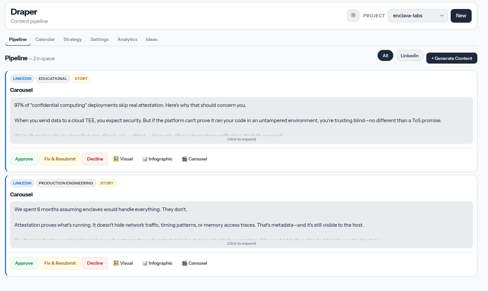
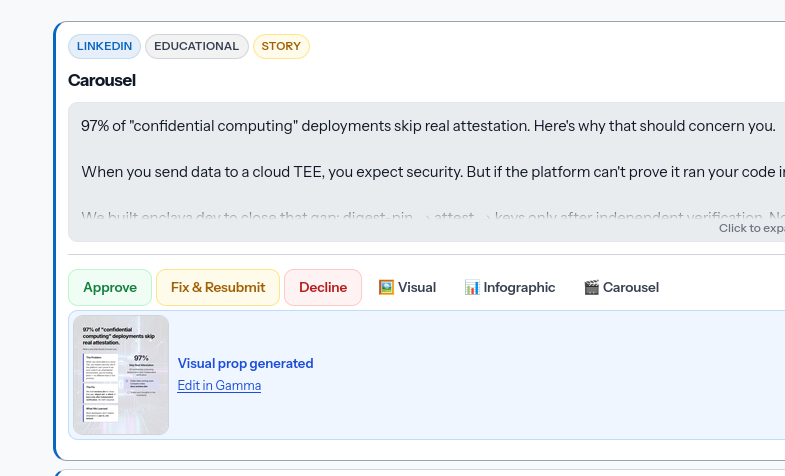
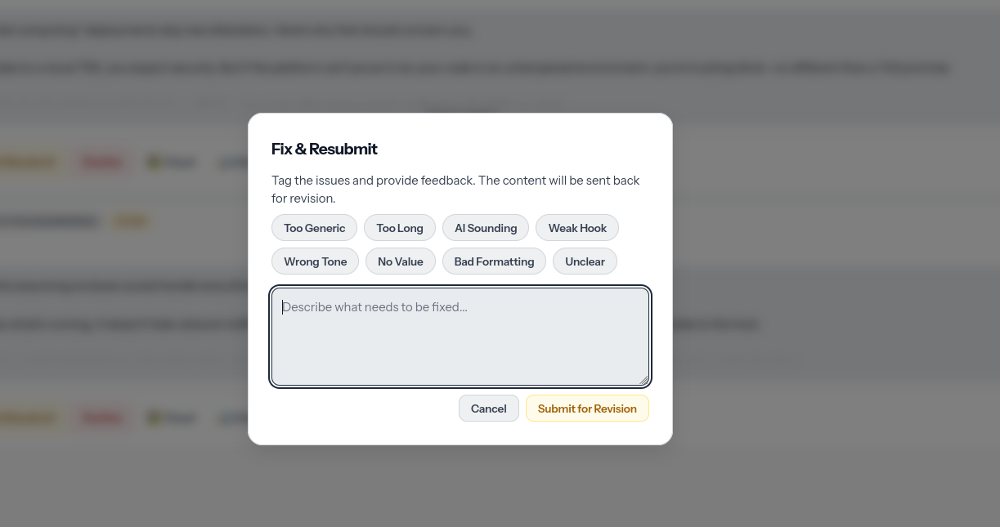

# Draper

Draper is a local-first marketing pipeline. You keep a content plan per brand,
generate drafts with an LLM, approve them yourself, then schedule the approved
posts to the accounts you already run.

Nothing publishes until a person says so. Each brand is its own project, with
its own queue, voice, and destinations, so one client's draft cannot go out as
another's.



## Who it is for

People who run more than one social presence and want AI drafts without giving
up the approval step. If you already post through Typefully, Late, or Nostr,
this is the generation and review layer in front of those accounts, instead of
a pile of ChatGPT tabs and spreadsheets.

The product is the loop: plan, draft, review, schedule.

## What you can do

- Keep several brands in one install, each with its own content plan, profiles,
  and posting times.
- Generate Twitter/X threads, LinkedIn posts, newsletters, blogs, landing copy,
  press releases, and case studies from that plan.
- Review, edit, and approve in a web dashboard (or from the CLI).
- Attach a generated visual, infographic, or carousel to a draft before you
  approve it.
- Schedule approved work through Typefully (X, LinkedIn, Threads, Mastodon),
  Late (Instagram, TikTok, YouTube, and others), or Nostr.
- See a calendar of what is queued, plus analytics on what already went out.



Drafts follow the brand voice, hooks, and CTAs you configure per project.

## How it works

1. Write or update the project's content plan (a short markdown contract).
2. Generate a batch of drafts for the platforms you care about.
3. Open the dashboard, approve what is good, reject the rest. Send a draft
   back with tags and a note if it needs another pass.
4. Schedule the approved items. Draper sends them to the project's configured
   accounts and skips anything tagged to a different brand.



That last check is the whole safety model: content is tagged at generation, and
scheduling will refuse to post it under the wrong project.

## Get started

Python 3.13+, [uv](https://docs.astral.sh/uv/), an LLM API key, and at least one
publishing provider.

```bash
git clone https://github.com/your-org/draper.git
cd draper
uv venv
uv pip install -e .
source .venv/bin/activate
cp .env.example .env
```

Put your keys in `.env`, then:

```bash
draper project add mybrand -d "What this brand talks about"
draper review --web
```

The dashboard is at http://localhost:8765. Set `DRAPER_DASHBOARD_TOKEN` before
exposing it to anything other than a private machine; see
[production](docs/production.md) for how that is meant to run.

A walkthrough of the plan format lives in
[docs/content-plan-format.md](docs/content-plan-format.md), with a filled-in
example at [examples/content_plan.simple.example.md](examples/content_plan.simple.example.md).

## Docs

| If you want to | Read |
| --- | --- |
| Deploy, back up, or lock down the dashboard | [docs/production.md](docs/production.md) |
| Write content plans the generator can parse | [docs/content-plan-format.md](docs/content-plan-format.md) |
| Publish to Nostr | [docs/nostr-publishing.md](docs/nostr-publishing.md) |
| Contribute or run tests | [CONTRIBUTING.md](CONTRIBUTING.md) |
| Report a security issue | [SECURITY.md](SECURITY.md) |

## License

MIT. See [LICENSE](LICENSE).
